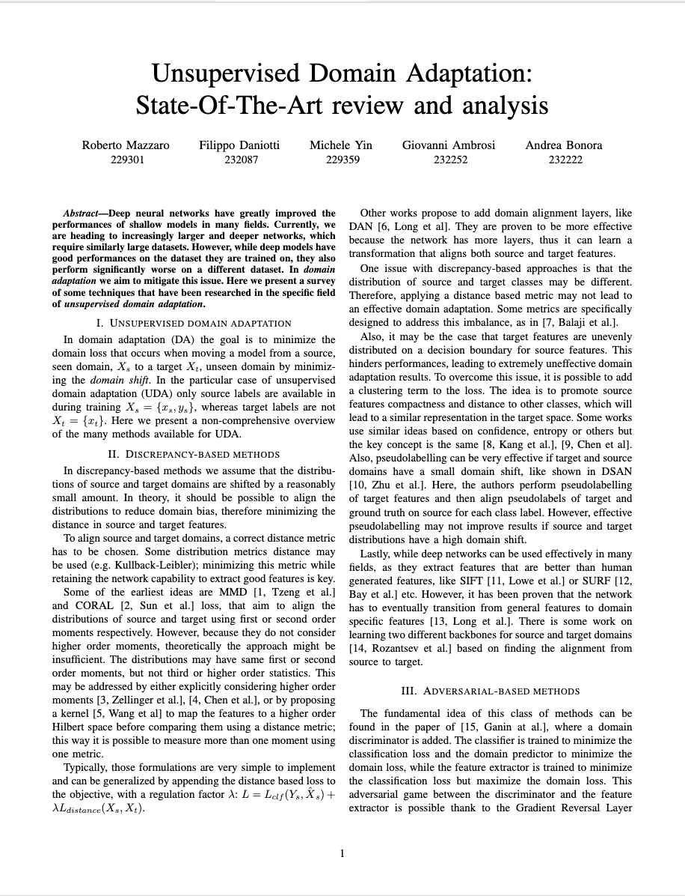
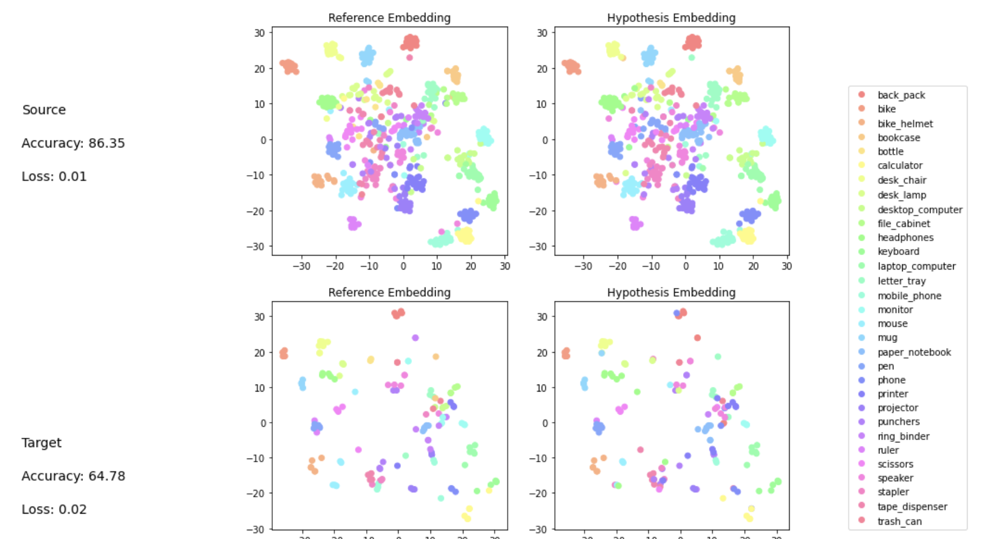
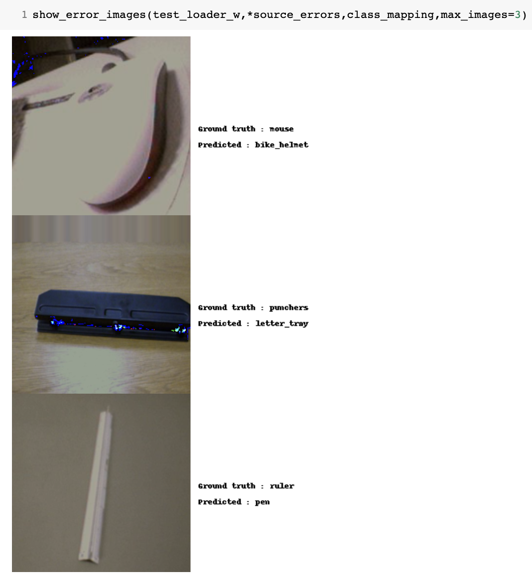
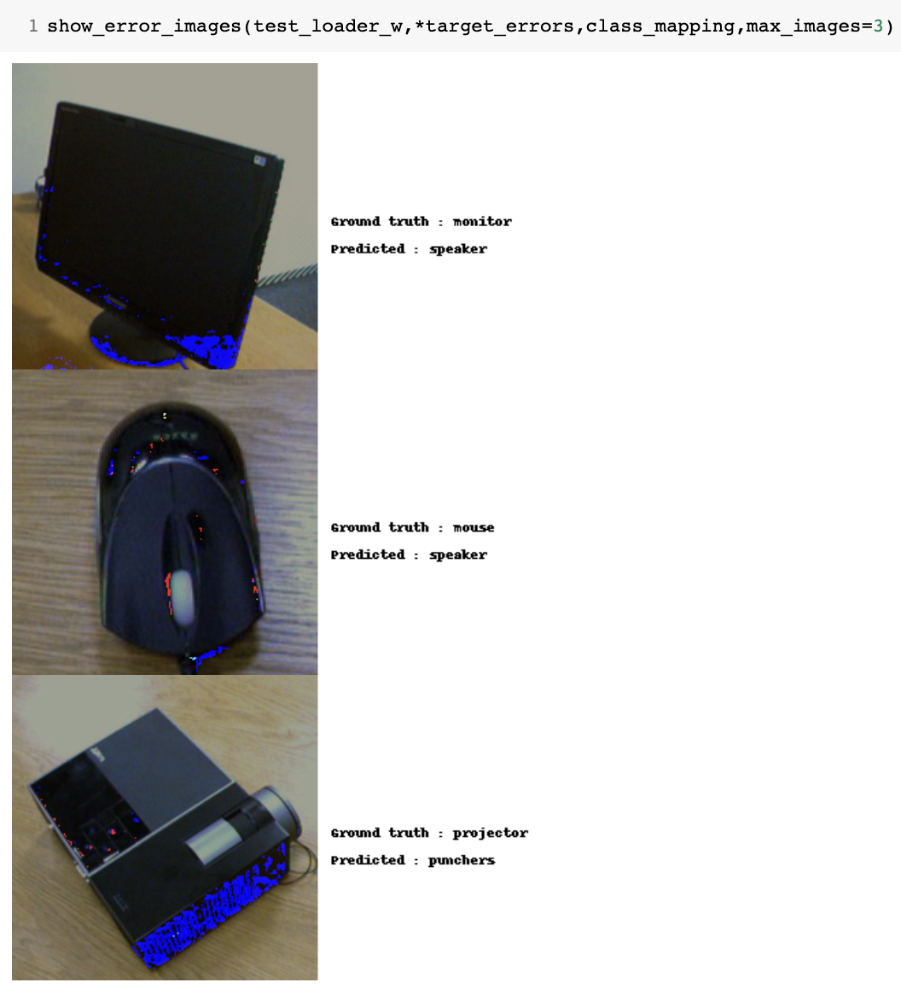

# Domain Adaptation 
The goal of this project was to explore the topic of Domain Adaptation, with an initial anaylis of the SOTA and then hands-on trying to improve DANN and ablation studies of self training

## Outline

| <a href="docs/presentations/TACV-I-milestone.pdf" target="_blank"><b>First presentation</b></a> | <a href="docs/report/report.pdf" target="_blank"><b>Report</b></a> | <a href="docs/presentations/TACV-final-presentation.pdf" target="_blank"><b>Final presentation</b></a> |
|--------------------------------------------------------------------------------------------------------------------------|---------------------------------------------------------------------------------------------------------------------------------|--------------------------------------------------------------------------------------------------------------------------------|
|               |          |         |

## First presentation
The first presentation can be found [here](static/assets/presentations/TACV-I-milestone.pdf)

In the first presentation we focused on an overview of SOTA **Unsupervised Domain Adaptation**, trying to understand the different available methods and their differences
## Report
The report can be found here [here](docs/report/report.pdf).
This report aims to provide a synthetic overview of what we have found from an initial anaylis of the topic of **UDA**. Although not exhaustive, we exensively researched the field in order to provide a overall summary.
## Notebooks
The notebooks used for the test and analysis are [here](src/notebooks/)
The main ideas are two:
- [adversarial_architectures.ipynb](src/notebooks/adversarial_architectures.ipynb): try to **combine and merge** different approached, starting from **DANN** and building of top of that. 
- [aux_self_train.ipynb](src/notebooks/aux_self_train.ipynb): in depth analysis and ablation study on **self-training**, because the technique is very unique and we wanted to shed light on its mechanism. Also an official implementation was not available. 

| [adversarial_architectures.ipynb](src/notebooks/adversarial_architectures.ipynb) | [aux_self_train.ipynb](src/notebooks/aux_self_train.ipynb) |
| -------------------------------------------------------------------------------- | ---------------------------------------------------------- |
 <a target="_blank" href="https://colab.research.google.com/github/filippodaniotti/TACV-DA-project/blob/master/src/notebooks/adversarial_architectures.ipynb">   | <a target="_blank" href="https://colab.research.google.com/github/filippodaniotti/TACV-DA-project/blob/master/src/notebooks/aux_self_train.ipynb">   |

We also created a pipeline of standardized operations for testing, in order to speed up evaluation 

|

| 

| 

|
|--------------------------------------------------------------------------------------------------------------------------|---------------------------------------------------------------------------------------------------------------------------------|--------------------------------------------------------------------------------------------------------------------------------|
|               |          |         |
|              |          |         |

## Second presentation
The second presentation can be found here [here](static/assets/presentations/TACV-final-presentation)
In here we discuss the results of both our research in combination of different techniques and our ablation study.

In the end a very brief summary is:
- Merging DA techniques may not always result in the expected perfomances of the single approaches
- Overlaying DA techniques may result in overly complicated architectures
- More often than not DA techniques need dataset and model specific tuning, making transferability not trivial
- Not all DA techniques may be applied to every dataset. In particular a preemptive dataset analysis to choose the best suited DA technique for the dataset can increase the results significantly

## Implemented papers

**Unsupervised Domain Adaptation by Backpropagation**

Ganin et al. 2014

https://arxiv.org/abs/1409.7495

Find it in [adversarial_architectures.ipynb](src/notebooks/adversarial_architectures.ipynb)

---

**Deep Domain Confusion: Maximizing for Domain Invariance**

Tzeng et al. 2014 

https://arxiv.org/abs/1412.3474

Find it in [adversarial_architectures.ipynb](src/notebooks/adversarial_architectures.ipynb)

---

**Deep CORAL: Correlation Alignment for Deep Domain Adaptation**

Sun et al. 2016

https://arxiv.org/abs/1607.01719

Find it in [adversarial_architectures.ipynb](src/notebooks/adversarial_architectures.ipynb)

---

**Reusing the Task-specific Classifier as a Discriminator: Discriminator-free Adversarial Domain Adaptation**

Chen et al. 2022

https://ieeexplore.ieee.org/document/9879990

Find it in [adversarial_architectures.ipynb](src/notebooks/adversarial_architectures.ipynb)

---

**A Closer Look at Smoothness in Domain Adversarial Training**

Rangwani et al. 2022

https://arxiv.org/abs/2206.08213

Find it in [adversarial_architectures.ipynb](src/notebooks/adversarial_architectures.ipynb)

---

**Gradient Distribution Alignment Certificates Better Adversarial Domain Adaptation**

Gao et al. 2022

https://ieeexplore.ieee.org/document/9710736

Find it in [adversarial_architectures.ipynb](src/notebooks/adversarial_architectures.ipynb)

---

**Re-energizing Domain Discriminator with Sample Relabeling for Adversarial Domain Adaptation**

Jin et al. 2021

https://arxiv.org/abs/2103.11661

Find it in [adversarial_architectures.ipynb](src/notebooks/adversarial_architectures.ipynb)

---

**Incremental Unsupervised Domain-Adversarial Training of Neural Networks**

Gallego et al. 2021

https://ieeexplore.ieee.org/document/9216604

Find it in [adversarial_architectures.ipynb](src/notebooks/adversarial_architectures.ipynb)

---

**Gradual Domain Adaptation via Self-Training of Auxiliary Models**

Zhang et al. 2021

https://arxiv.org/abs/2106.09890

Find it in [aux_self_train.ipynb](src/notebooks/aux_self_train.ipynb.ipynb)
