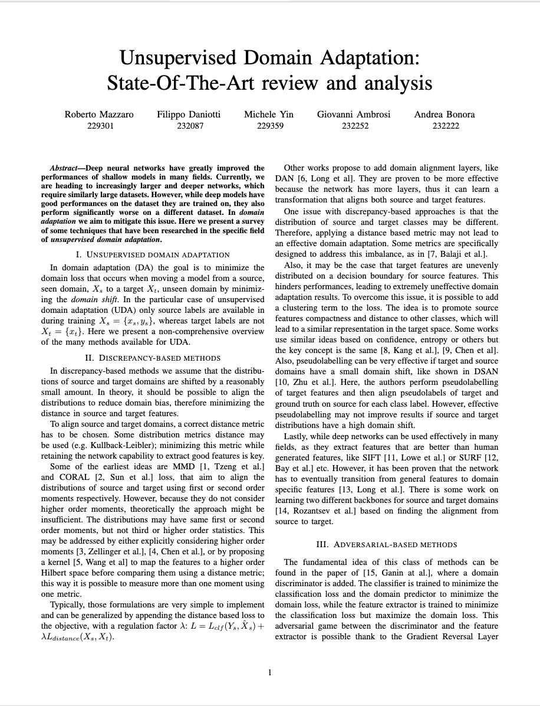
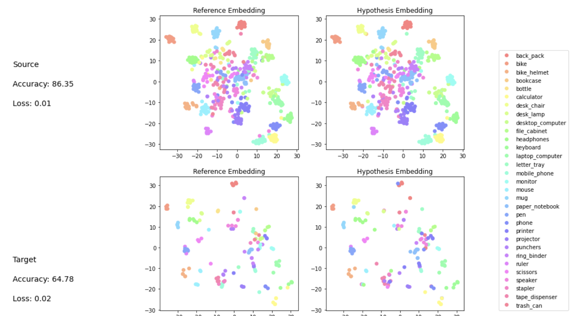
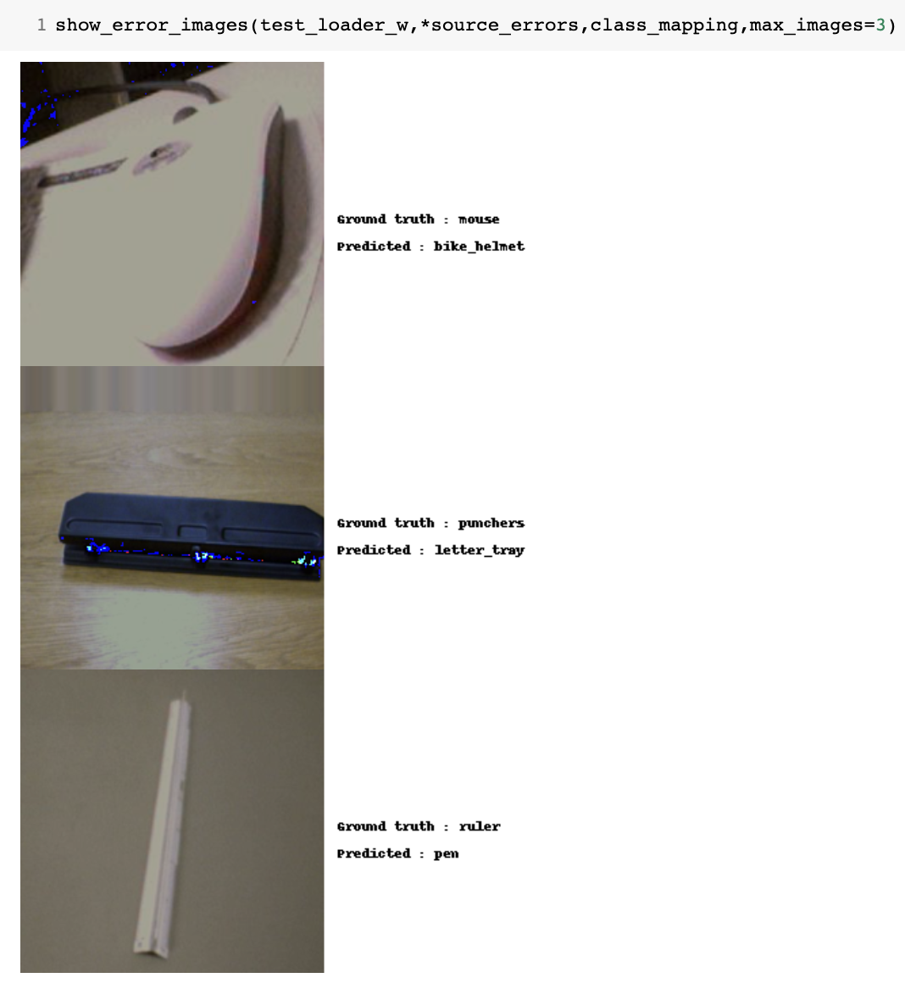
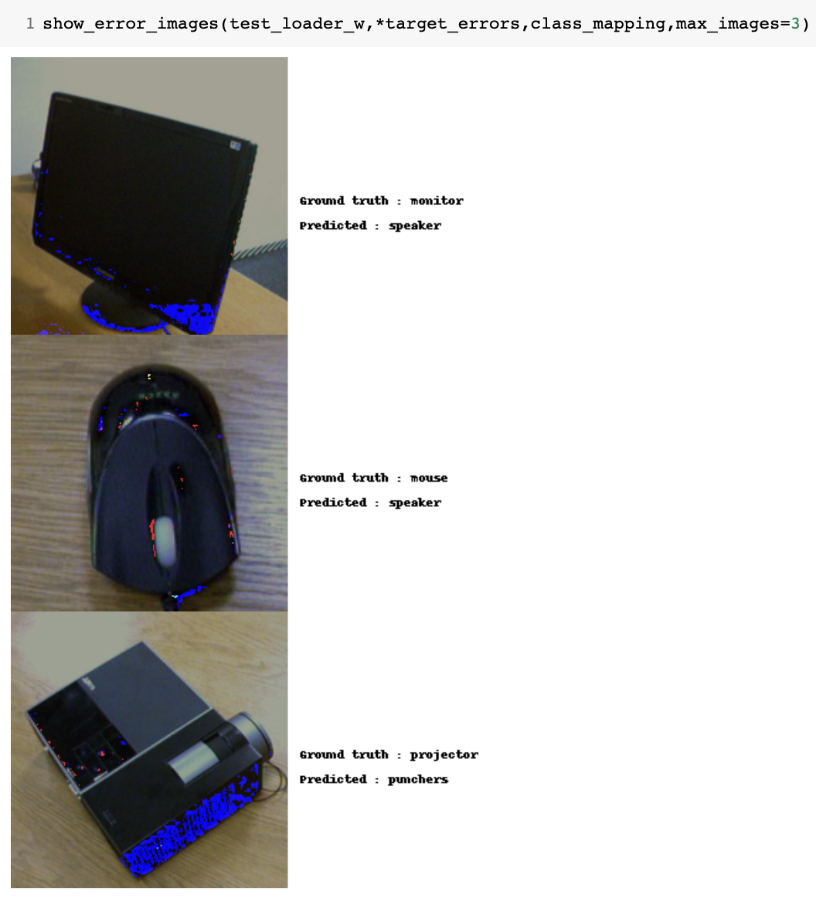

# Domain Adaptation 
Course: Trends and Application of Computer Vision

The goal of this project was to explore the topic of Domain Adaptation, with an initial anaylis of the SOTA and then hands-on trying to improve DANN and ablation studies of self training

## Outline
| <a href="docs/presentations/TACV-I-milestone.pdf" target="_blank"><b>First presentation</b></a> | <a href="docs/report/report.pdf" target="_blank"><b>Report</b></a> | <a href="https://fedeizzo.github.io/ParticleSwarmOptimization-OpenMPI/presentation.pdf" target="_blank"><b>Final presentation</b></a> |
|--------------------------------------------------------------------------------------------------------------------------|---------------------------------------------------------------------------------------------------------------------------------|--------------------------------------------------------------------------------------------------------------------------------|
|               |          |         |

## First presentation
The first presentation can be found [here](docs/presentations/TACV-I-milestone.pdf)

In the first presentation we focused on an overview of SOTA **Unsupervised Domain Adaptation**, trying to understand the different available methods and their differences
## Report
The report can be found here [here](docs/report/report.pdf).
This report aims to provide a synthetic overview of what we have found from an initial anaylis of the topic of **UDA**. Although not exhaustive, we exensively researched the field in order to provide a overall summary.
## Notebooks
The notebooks used for the test and analysis are [here]()
The main ideas are two:
- Try to **combine and merge** different approached, starting from **DANN** and building of top of that. 
- In depth analysis and ablation study on **self-training**, because the technique is very unique and we wanted to shed light on its mechanism. Also an official implementation was not available. 

We also created a pipeline of standardized operations for testing, in order to speed up evaluation 

|               |          |         |
|--------------------------------------------------------------------------------------------------------------------------|---------------------------------------------------------------------------------------------------------------------------------|--------------------------------------------------------------------------------------------------------------------------------|
|              |          |         |
## Second presentation
The second presentation can be found here [here]()
In here we discuss the results of both our research in combination of different techniques and our ablation study.
